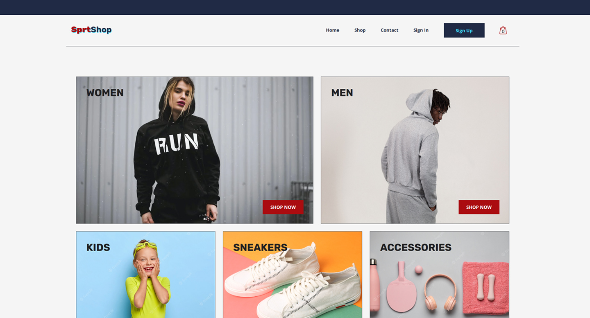

<h1 align="center">SprtShop</h1>

 
  
  
  
  
  

A scalable, fully responsive, and user-friendly sportwear apparel ecommerce website with stylish page layouts and sections.

<!-- Add Image -->

<!-- Add Image -->

<i>:triangular_flag_on_post: To anyone who wishes to make commits and push their own code, just make sure you fork the project first to have a copy of this repository.</i>

## <!-- -->

## Table of Contents

1. [My Approach to the Project](#approach)
2. [Build With](#buildwith)
3. [Composition and Features](#structure)
4. [Getting Started](#gettingstarted)
5. [How to Use](#howtouse)
6. [Acknowledgments](#acknowledgment)
7. [Learn More](#learnmore)

## My Approach to the Project 

To design and build a complex application using a diverse set of technologies and touching in depth important areas such as routing, state, data fetching from databases or development platforms, code testing, performance optimization, error handling, whilst simulating a professional work environment. Then:

- Defined the application to be built and its basic functionality.
- Sketched and designed the application wireframes and final designs.
- Defined the tasks and subtasks for each component and each page in the project.
- Opted to use a custom Kanban Board for managing the project tasks workflow.
- Defined the tech stack to build the application.

## Build With 

- [React](https://react.dev/)
- [JavaScript](https://developer.mozilla.org/en-US/docs/Web/javascript)
- [Styled Components](https://styled-components.com/)
- [React Redux](https://react-redux.js.org/)
- [Firebase](https://firebase.google.com/docs)
- [React Router DOM](https://v5.reactrouter.com/web/guides/quick-start)
- [React Bootstrap Icons](https://www.npmjs.com/package/react-bootstrap-icons)
- [React Error Boundary](https://www.npmjs.com/package/react-error-boundary/v/3.0.2)

### Additional Inputs

- **Styled-components** library since is CSS in JavaScript, it's flexible, uses template literals, and has numerous features to get the styles you want.
- **Redux** for state management, mainly because, it makes easier handling complex logic, manage app state in a single place, keep the state minimal, derive and memoize additional values whenever possible, and persist data on local storage.
- **Jest** along with **React Testing Library** since testing is an important and essential part of writing better code and delivering better applications for production. Created and performed unit and integrations tests, including snapshot testing covering the essential features of the application.
- Created and performed **manual tests** cases to ensure the UI/UX, error handling, and features facing the end user behaved as expected across most common browsers.
- **React Router DOM** for handling Client-side routing in the application since it's dynamic, it helps to deliver a seamless user experience, and it has good additional features.
- **Firebase** for user authentication, it has good support, good documentation and it's easy-to-use.
- **Firestore** is a flexible and scalable NoSql database easy to set up.
- **React Bootstrap Icons** is one of my favorites when it comes to svg icons, easy and simple to use, high quality, and great for customization.
- **React Error Boundary** because it provides a simple way to add reusable wrappers to catch rendering errors and then, allows us to handle them in neat and effective ways.
- **React Lazy** and **React Memo** for optimizing app performance and user experience overall.

## Composition and Features 

- Header with Logo, navigation menu, shopping bag icon and shopping bag dropdown.
- Home Page with links to each one of the collections pages.
- Shop Page with preview of 4 items per each collection page and its respective link.
- 5 Collection pages with all the available items, total items, and filters.
- Item card with product name, price, and an add to bag button.
- Simple Contact Page with some mock contact information.
- Sign In Page with functional sign in options through providers such as Google, Github, and email and password. Connects to Firebase Auth. Set up requirements and validations for passwords, error handling for incorrect or not registered email addresses.
- Password reset handling in real time, and error handling for incorrect or not registered email addresses.
- Sign Up page with specific requirements and validations for each input field. Error handling for passwords not matching and users already registered.
- Application connects with Firestore Database to store collections data and registered users. It fetches collections data and successfully signed in users to dynamically render the navigation menu, and the sign out option.
- Shopping dropdown and checkout page with the options to add, decrease, and remove items, show total quantity of items and total amount.
- Footer with different sections including about us, follow us and its social network icons, accepted payment methods icons, and a section for additional information.
- Something Went Wrong and 404 Error Page.
- Fully responsive adjusting to several different screen sizes and user-friendly website.

## Getting Started 

You will need **[Node.js](https://nodejs.org/en/download/)** and **[Git](https://git-scm.com/)** installed and running on your local machine.

Fork this repository to have your own copy in your GitHub profile. After forking this project, just clone it, then you can commit and push to it freely.

## How to Use 

In the terminal on your local machine after you have cloned the project:

### Install all dependencies

`$ npm install` or `$ yarn install`

### Start development server

`$ npm start` or `$ yarn start`

- Runs the app in the development mode.
- Open [http://localhost:3000](http://localhost:3000) to view it in your browser.
- The page will reload when you make changes.
- You may also see any lint errors in the console.

### Build for production

`$ npm run build` or `$ yarn build`

- Builds the app for production to the `build` folder.
- It correctly bundles React in production mode and optimizes the build for the best performance.
- The build is minified and the filenames include the hashes.
- Your app is ready to be deployed!

See the section about [deployment](https://facebook.github.io/create-react-app/docs/deployment) for more information.

### Firebase

Go to **[Firebase](https://firebase.google.com/)** and click the **Go to Console** option, then start creating your project and follow the prompts.

#### Firebase Config File

The configuration variable is automatically created and provided by Firebase after you have created your project. Copy it and paste it in the firebase.utils.js file.

    firebaseConfig = {
    apiKey: "AbCdEf01234gHiJkL56789",
    authDomain: "[your-project-database-name].firebaseapp.com",
    projectId: "[your-project-id]",
    storageBucket: "[your-project-database-name].appspot.com",
    messagingSenderId: "0123456789",
    appId: "3:12346789:web:a1b2c3d4e5f6g7",
    };

When not using Firebase Firestore, just replace the value of the collections key in the INITIAL_STATE constant with the shopData variable `transformedCollections` that is commented out on the shop.reducer.js file. Then on the App.jsx file comment out line 42 `const unSubscribeFromSnapshot = () => dispatch(fetchCollectionsAsync());` and line 60 `unSubscribeFromSnapshot();.`

#### Shop Data

Within the Shop Redux folder, you will find the shop-data.js file with the sample of the data and structure used for the collections pages. Feel free to use it and modify it.

## License

This project is licensed under the MIT License. Read the **LICENSE** file for additional details.

## Acknowledgment 

All the photos used in this project are intended only to illustrate the project and its features. All the rights on them belong to their legal owners on:

- Pexels
- Freepik
- Unsplash

## Learn More 

You can learn more in the [Create React App documentation](https://facebook.github.io/create-react-app/docs/getting-started).

### Code Splitting

This section has moved here: [https://facebook.github.io/create-react-app/docs/code-splitting](https://facebook.github.io/create-react-app/docs/code-splitting)

### Analyzing the Bundle Size

This section has moved here: [https://facebook.github.io/create-react-app/docs/analyzing-the-bundle-size](https://facebook.github.io/create-react-app/docs/analyzing-the-bundle-size)

### Making a Progressive Web App

This section has moved here: [https://facebook.github.io/create-react-app/docs/making-a-progressive-web-app](https://facebook.github.io/create-react-app/docs/making-a-progressive-web-app)

### Advanced Configuration

This section has moved here: [https://facebook.github.io/create-react-app/docs/advanced-configuration](https://facebook.github.io/create-react-app/docs/advanced-configuration)

### Deployment

This section has moved here: [https://facebook.github.io/create-react-app/docs/deployment](https://facebook.github.io/create-react-app/docs/deployment)

### `npm run build` fails to minify

This section has moved here: [https://facebook.github.io/create-react-app/docs/troubleshooting#npm-run-build-fails-to-minify](https://facebook.github.io/create-react-app/docs/troubleshooting#npm-run-build-fails-to-minify)
